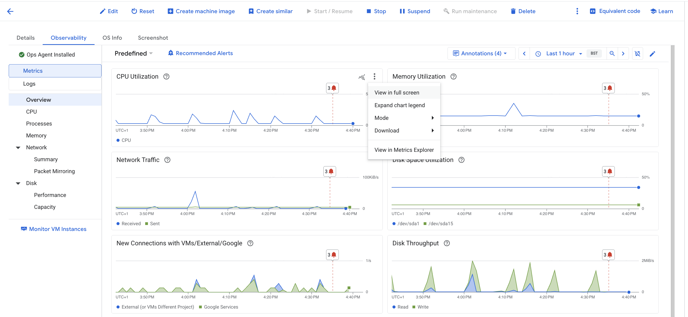
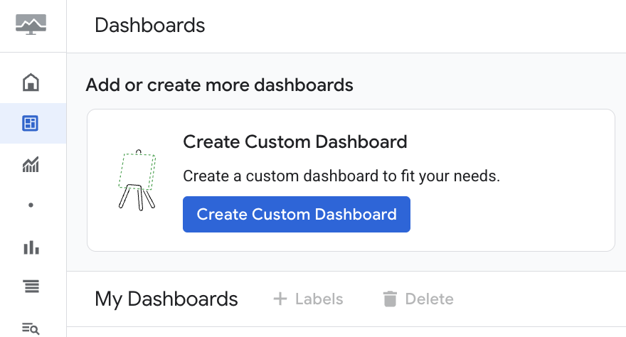
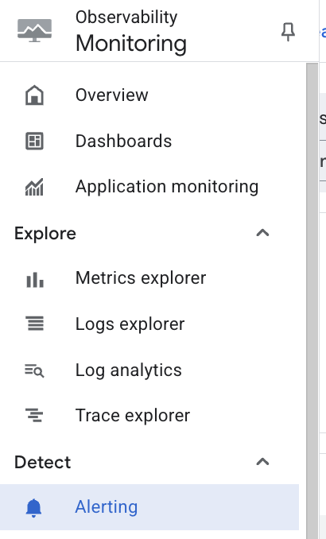
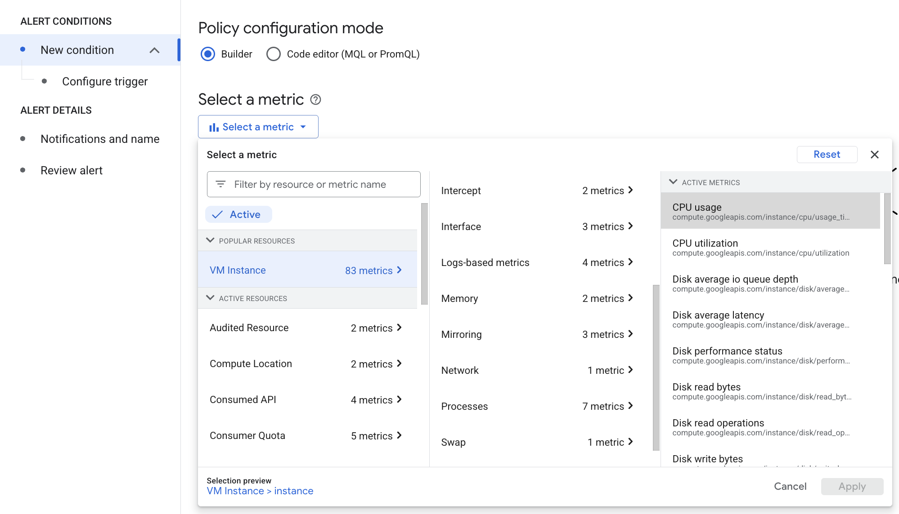
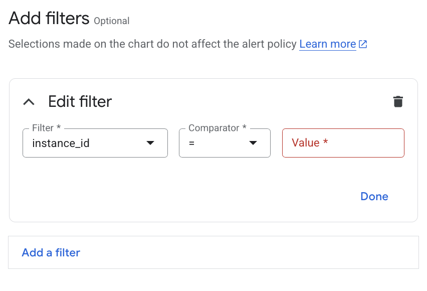
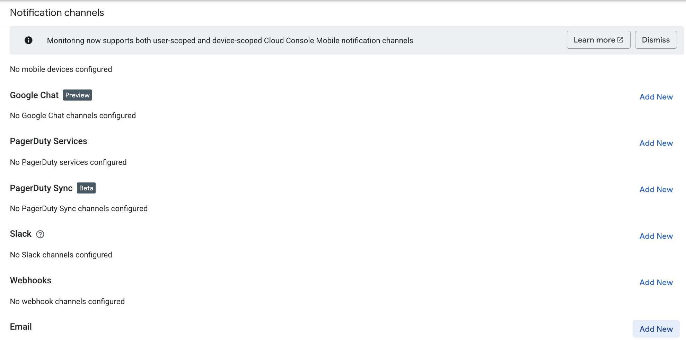
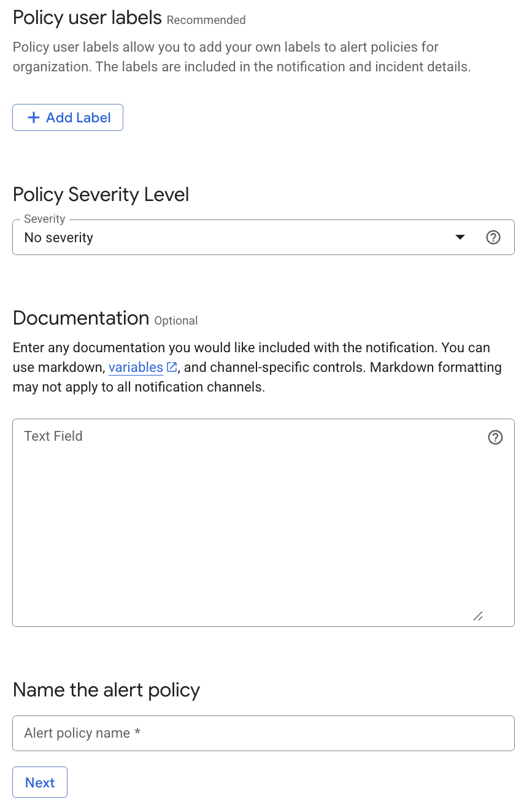

# GCP Alert Management

This piece of documentation is intended to explain how GCP can be configured for efficient and utility oriented alert management. 

- [GCP Alert Management](#gcp-alert-management)
  - [Dashboards](#dashboards)
    - [Setting Up a New Dashboard](#setting-up-a-new-dashboard)
    - [Accessing an Aready Made Dashboard](#accessing-an-aready-made-dashboard)
  - [Alert Policy](#alert-policy)
    - [Why Use Alert Policies](#why-use-alert-policies)
    - [How to Construct an Alert Policy](#how-to-construct-an-alert-policy)
  - [Load Testing](#load-testing)
  - [Cleaning Up After One's Self](#cleaning-up-after-ones-self)

## Dashboards

### Setting Up a New Dashboard
To set up a dashboard for any given GCP VM, firstly you need to navigate to that VM instance in the VM Instance tab.
1. Select the VM to get more information about it.
2.  Go to the Oberservability tab. 
3.  Select the metric (i.e. Memory Utilisation, CPU Utilisation, Network Traffic) that you want to get information about. 
4.  View that metric in full screen. 
5.  Select the 'save to dashboard' button, making sure that you give the chart a useful/informative name, and choose which dashboard you wish to save that chart to. 

### Accessing an Aready Made Dashboard
If you already have a dashboard created and you simply wish to view it, you can do this by :
1. Navigating to the Dashboard tab via the search bar at the top of the Google console.
2. Selecting which dashboard you wish to view from the list of existing dashboards. 

## Alert Policy

### Why Use Alert Policies
Whilst dashboards are very handy at helping you monitor the day to day performance and activity of your applications, they're less effecitive at warning you when some aspect of your application is failing. This is where GCP's alert policies come into play.

An alert policy can be constructure to warn you when target conditions are met, such as a metric returning an unusual result or not returning a result at all. For example, if your application is designed to handle web traffic, you can construct an alert that will fire when the network traffic reaches too high or too low a level. This allows  you to react quickly and pro-actively to any issues as they arise. 

Depending on how you configure your alert policy GCP can send a notification via email/Slack/SMS to inform key stakeholders in the project of what's afoot. The information attached to the alert ticket will contain valuable insight as to what's gone wrong and why the alert has been triggered, thereby expediting the problem solving process for those involved. 

### How to Construct an Alert Policy
As with observing your application's metrics, the alert policty feature can be found in the Observability tab of the Google Cloud Console. 

1. Select the 'Create Policy Option'.

2. Choose which metric you want the alert policy to be monitoring (i.e. CPU usage, uptime, sent bytes).
  

3. Apply filters to the policy, so it can be targeted towards specific VM instances or features of an application. 
   
   

4.  Select the notification channels you want the alert to be sent to if it's triggered. 

  

5. Attach policy specific labels and documentation to help distinguish what this alert is aimed at catching and potentially how to resolve it. 

  

Once the above steps have been completed and your policy as been submitted, it will be live. 

## Load Testing 
To aritificially trigger a an alert policy we made use of the `apache2-utils` package, specifically the apache benchmark tool. This is a tool that allows you to observe how many requests per second your target application is capable of handling.  

``ab -n 1000 -c 100 http://yourwebsite.com/``

In the above code example there are two flags. The first one `-n` allows you specify how many requests requests you want performed for this benchmark session. The second flag `-c` specifies stands for concurrency, letting you dictate how many requests you want sent simultaneously. 

By targeting this command to our app's external IPs we could artifically trigger CPU usage alert. The more requests received by the app, the higher the demand on the CPU. This allowed us to load test our applications, giving us observable feedback via GCP's metric dashboards showing the app receiving the requests. 

## Cleaning Up After One's Self
If an alert policy is no longer needed, the Google Cloud Console allows you to delete them in much the same way you created them. 

In a similar vein, if there is a dashboard that you no longer have need of, it too can be deleted via the GCP console. 